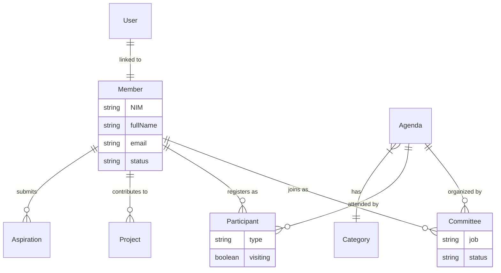
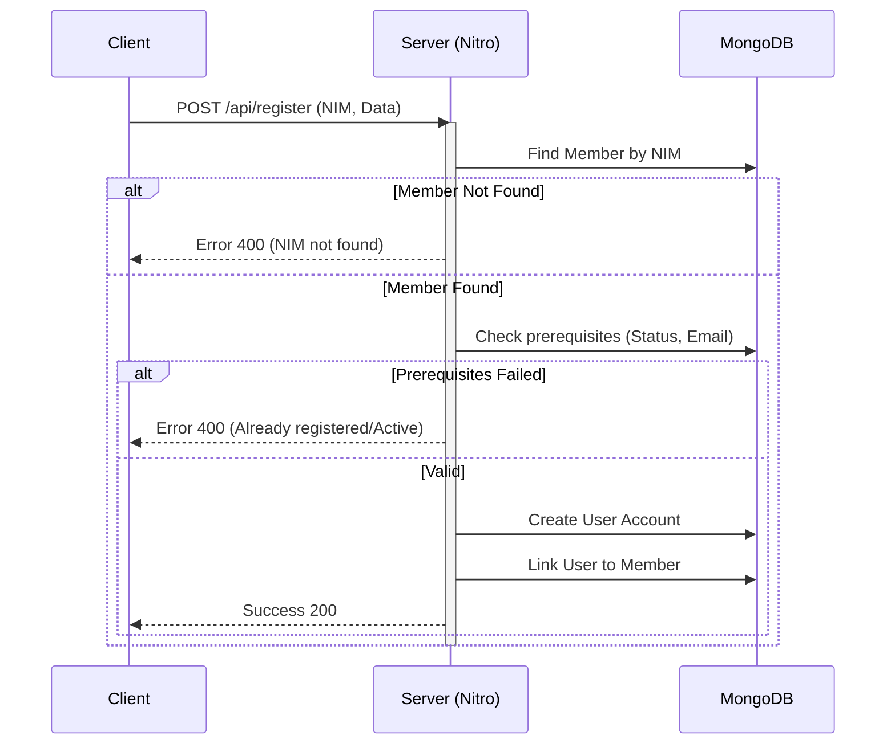
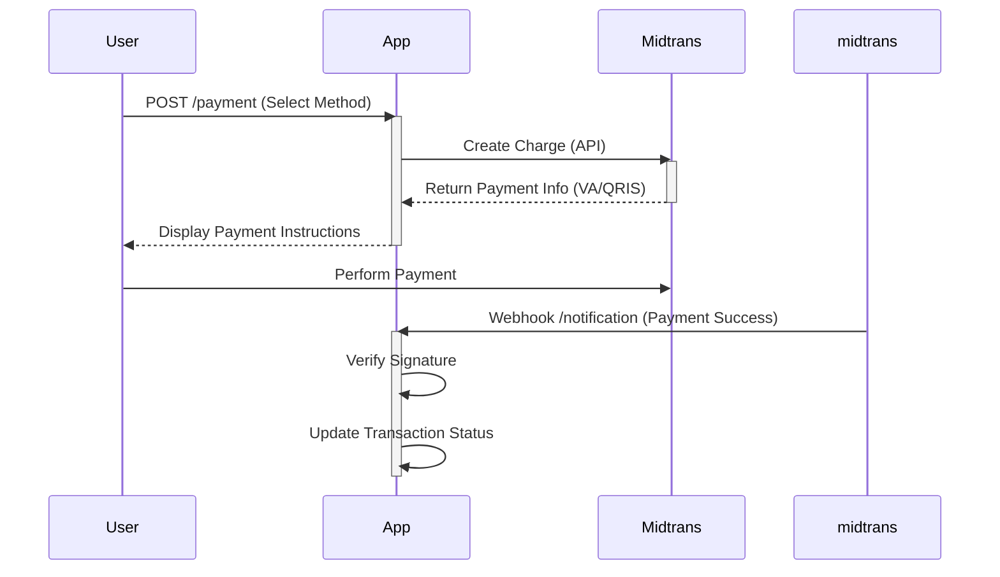
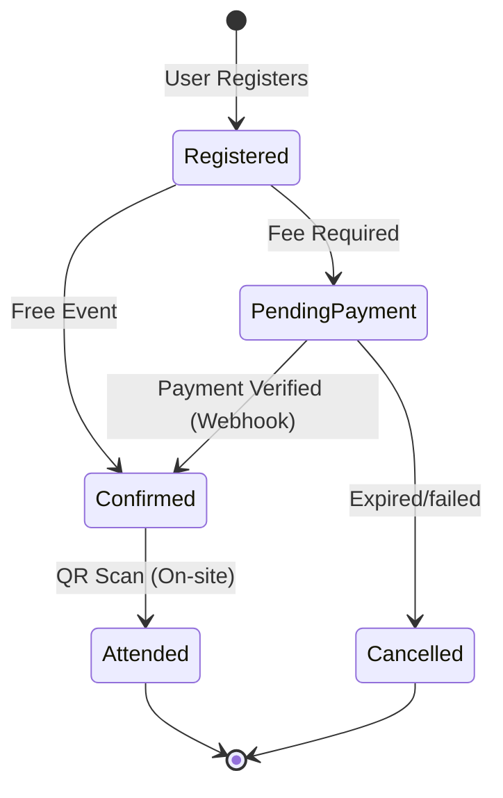
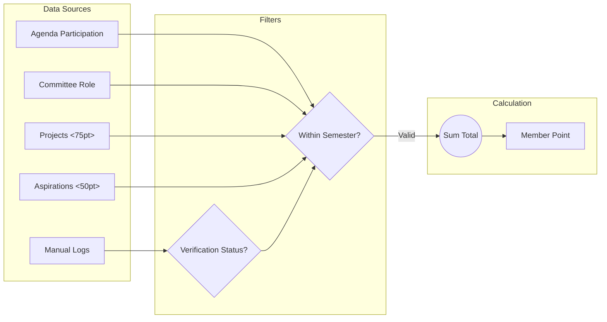
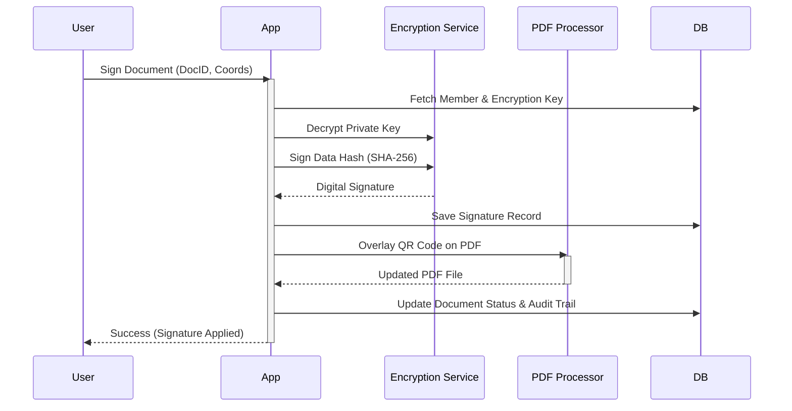

# Himatika - Student Association Platform

A comprehensive web application built with **Nuxt 3** for managing the Himatika student association. This platform includes features for event management, news distribution, member profiles, and administrative tools.

## 🚀 Features

- **Public Portal**:
  - **Homepage & News**: SWR (Stale-While-Revalidate) caching for high performance.
  - **Agendas/Events**: Browse upcoming events and activities.
- **User Dashboard** (SPA):
  - **Profile Management**: Manage personal data, academic info, and documents.
  - **Authentication**: Secure login/register with session management.
- **Administration**:
  - **CMS**: Manage news, agendas, and users.
  - **Committee Tools**: Generate tickets, manage participants.
- **Advanced Features**:
  - **PDF Generation**: Auto-generate tickets and documents.
  - **QR Codes**: For event attendance and ticketing.
  - **Payments**: Integrated with **Midtrans**.
  - **Media**: Image uploads (S3/R2/Vercel Blob) and video playback.
  - **Localization**: Support for ID, EN, and AR.

## 🛠 Tech Stack

- **Framework**: [Nuxt 3](https://nuxt.com/)
- **Language**: TypeScript
- **Database**: MongoDB (via [Mongoose](https://mongoosejs.com/))
- **UI Framework**: [Nuxt UI](https://ui.nuxt.com/) (Tailwind CSS)
- **State Management**: [Pinia](https://pinia.vuejs.org/)
- **Authentication**: [@sidebase/nuxt-auth](https://sidebase.io/nuxt-auth)
- **File Storage**: AWS S3 / Cloudflare R2 / Vercel Blob
- **Utilities**:
  - `pdf-lib` / `pdf-parse` for PDF handling
  - `sheetjs` (exceljs) for data export
  - `nuxt-i18n-micro` for internationalization

## 📦 Setup & Installation

1. **Clone the repository**:

   ```bash
   git clone <repository-url>
   cd himatika
   ```

2. **Install dependencies**:

   ```bash
   npm install
   # or
   pnpm install
   # or
   bun install
   ```

3. **Environment Setup**:
   Create a `.env` file in the root directory. You can copy the `.env.example` if available, or ensure the following variables are set:

   ```env
   # App & Security
   APPNAME="Himatika"
   VERSION="1.0.0"
   PUBLIC_URI="http://localhost:3000"
   PUBLIC_URI_API="http://localhost:3000/api"
   JWT_SECRET="your_jwt_secret"
   NODE_ENV="development"

   # Database
   HIMATIKA_MONGODB_URI="mongodb+srv://..."
   DBNAME="himatika_db"

   # Authentication
   NEXTAUTH_URL="http://localhost:3000"
   NEXTAUTH_SECRET="your_nextauth_secret"

   # Storage (Choose your provider credentials)
   BLOB_READ_WRITE_TOKEN="..."
   BLOB_URI="..."
   R2_ACCOUNT_ID="..."
   R2_ACCESS_KEY_ID="..."
   R2_SECRET_ACCESS_KEY="..."
   R2_BUCKET_NAME="..."
   R2_PUBLIC_DOMAIN="..."

   # Mail (Mailtrap)
   MAILTRAP_TOKEN="..."
   MAILTRAP_DOMAIN="..."

   # Payment (Midtrans)
   MIDTRANS_URL="https://app.sandbox.midtrans.com/snap/v1/transactions"
   MIDTRANS_CLIENT_KEY="..."
   MIDTRANS_SERVER_KEY="..."

   # Recaptcha
   RECAPTCHA_SITE_KEY="..."
   RECAPTCHA_SECRET_KEY="..."
   ```

4. **Run Development Server**:

   ```bash
   npm run dev
   ```

   Access the app at `http://localhost:3000`.

## 📜 Build & Deployment

The application uses different rendering strategies (`routeRules`) for optimization:

- **SPA**: Dashboard, Profile, Admin pages.
- **SWR**: News, Agendas.
- **Prerender**: Auth pages (Login, Register).

To build for production:

```bash
npm run build
```

Preview the production build locally:

```bash
npm run preview
```

## 📂 Project Structure

- `/app`: Main Vue/Nuxt application code.
- `/server`: API routes and backend logic (Nitro).
- `/locales`: i18n translation files.
- `/public`: Static assets.
- `/types`: TypeScript type definitions.

## 📊 System Design

### Architecture

```mermaid
graph TD
    User[User / Client] <-->|HTTPS| LoB[Load Balancer / Vercel]
    LoB <-->|Nuxt 3| App[Application Server]
    
    subgraph "Backend Services"
        App <-->|Mongoose| DB[(MongoDB)]
        App <-->|AWS SDK| Storage[Object Storage (S3/R2)]
        App -->|SMTP| Mail[Mailtrap]
        App <-->|API| Payment[Midtrans Payment Gateway]
    end

    subgraph "Core Modules"
        Auth[Authentication]
        CMS[Content Management]
        Event[Event System]
    end
    
    App --- Auth
    App --- CMS
    App --- Event
```

### Database Schema (ERD)

Simplified Entity-Relationship Diagram focusing on core interactions:



### Registration Flow

Sequence of events when a member registers for an account:



### Payment Integration Flow

Interaction with Midtrans Payment Gateway:



### Event Lifecycle

The lifecycle of an event participant:



### Points System Logic

How member points are calculated per semester:



### Digital Signature Flow

Secure signing process for documents:


