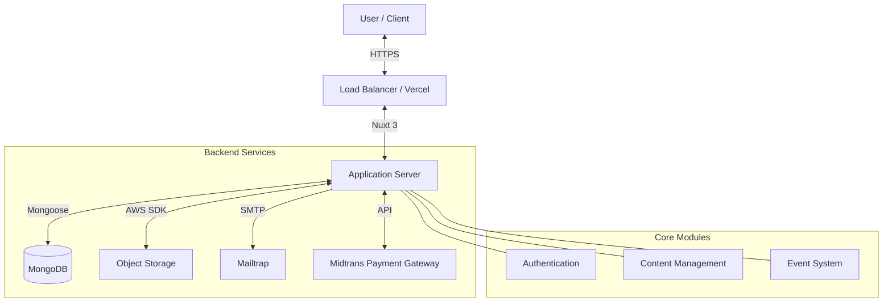
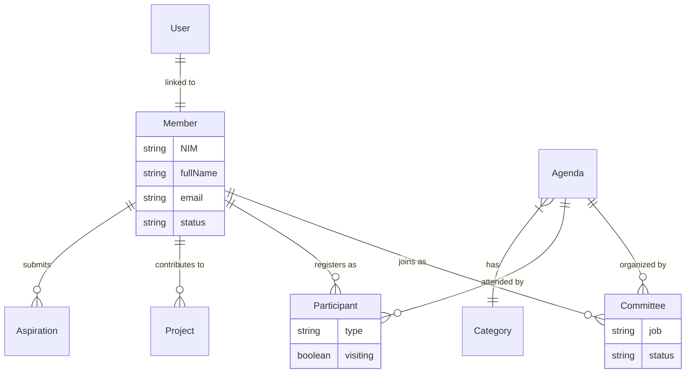
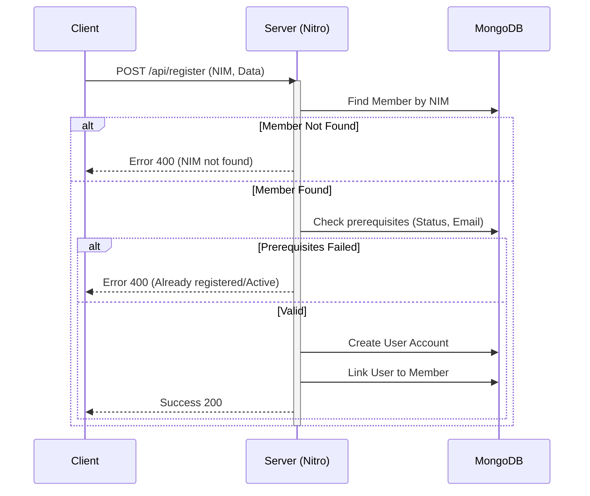
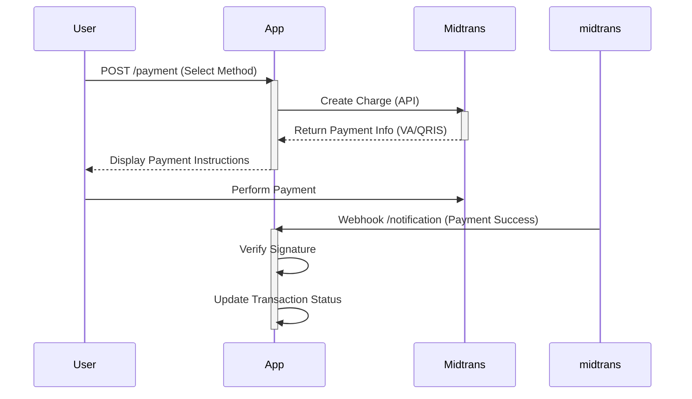
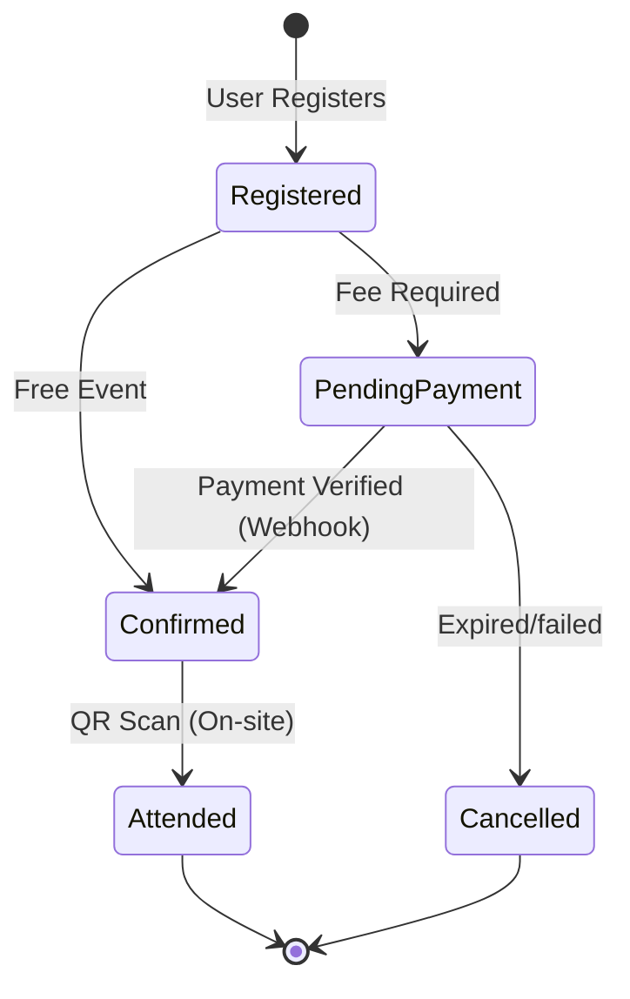
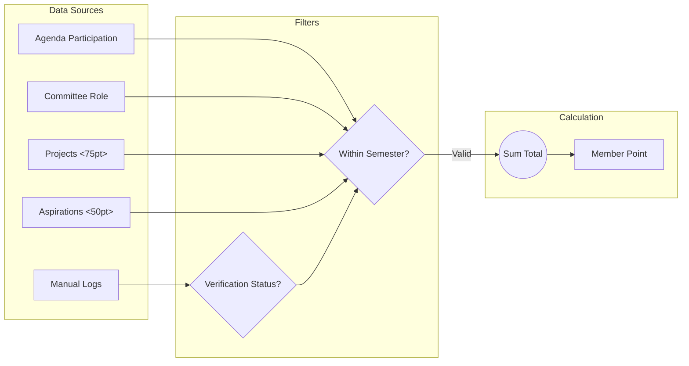
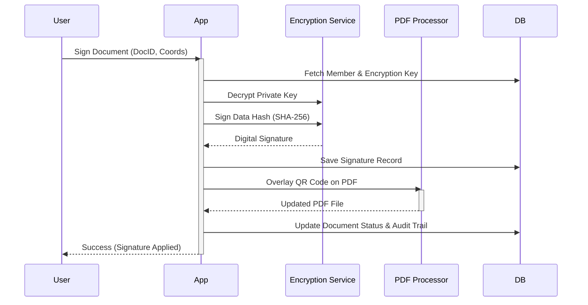

# Himatika - Student Association Platform

A comprehensive web application built with **Nuxt 4** for managing the Himatika student association. This platform includes features for event management, news distribution, member profiles, and administrative tools.

## 🚀 Features

- **Public Portal**:
  - **Homepage & News**: SWR (Stale-While-Revalidate) caching for high performance.
  - **Agendas/Events**: Browse upcoming events and activities.
- **User Dashboard** (SPA):
  - **Profile Management**: Manage personal data, academic info, and documents.
  - **Authentication**: Secure login/register with session management.
- **Administration**:
  - **CMS**: Manage news, agendas, and users.
  - **Committee Tools**: Generate tickets, manage participants.
- **Advanced Features**:
  - **PDF Generation**: Auto-generate tickets and documents.
  - **QR Codes**: For event attendance and ticketing.
  - **Payments**: Integrated with **Midtrans**.
   - **Media**: Image uploads (S3/R2) and video playback.
   - **Localization**: Support for ID (default) and EN.

## 🛠 Tech Stack

- **Framework**: [Nuxt 4](https://nuxt.com/)
- **Language**: TypeScript
- **Database**: MongoDB (via [Mongoose](https://mongoosejs.com/))
- **UI Framework**: [Nuxt UI](https://ui.nuxt.com/) (Tailwind CSS)
- **State Management**: [Pinia](https://pinia.vuejs.org/)
- **Authentication**: [@sidebase/nuxt-auth](https://sidebase.io/nuxt-auth)
- **File Storage**: AWS S3 / Cloudflare R2 (PDF documents via the separate `himatika-pdf-worker` service)
- **Utilities**:
  - `nuxt-i18n-micro` for internationalization
  - `zod` for request validation

## 📦 Setup & Installation

1. **Clone the repository**:

   ```bash
   git clone <repository-url>
   cd himatika
   ```

2. **Install dependencies** (Bun is the only supported package manager — the repo ships `bun.lock` and CI uses Bun):

   ```bash
   bun install
   ```

3. **Environment Setup**:
   Create a `.env` file in the root directory. Copy `.env.example` and fill in the values (see that file for the full variable list).

   ```env
   # App & Security
   APPNAME="Himatika"
   VERSION="1.0.0"
   PUBLIC_URI="http://localhost:3000"
   PUBLIC_URI_API="http://localhost:3000/api"
   JWT_SECRET="your_jwt_secret"
   NODE_ENV="development"

   # Database
   HIMATIKA_MONGODB_URI="mongodb://localhost:27017"
   DBNAME="himatika"

   # Storage (Cloudflare R2)
   R2_ACCOUNT_ID="..."
   R2_ACCESS_KEY_ID="..."
   R2_SECRET_ACCESS_KEY="..."
   R2_BUCKET_NAME="..."
   R2_PUBLIC_DOMAIN="..."

   # Mail (Resend)
   RESEND_API_KEY="..."
   RESEND_FROM="..."

   # Payment (Midtrans)
   MIDTRANS_URL="https://app.sandbox.midtrans.com/snap/v1/transactions"
   MIDTRANS_CLIENT_KEY="..."
   MIDTRANS_SERVER_KEY="..."

   # Encryption (openssl rand -hex 32) — rotating it makes old encrypted data unreadable
   ENCRYPTION_KEY="..."
   ```

   See `.env.example` for additional optional variables (reCAPTCHA, Google OAuth, QStash, WAHA, PDF worker).

4. **Run Development Server**:

   ```bash
   bun run dev
   ```

   Access the app at `http://localhost:3000`.

## 📜 Build & Deployment

The application uses different rendering strategies (`routeRules`) for optimization:

- **SPA**: Dashboard, Profile, Admin pages.
- **SSR + SWR**: News, Agendas.
- **SPA**: Auth pages (Login, Register).

To build for production (memory-hungry — the script raises Node's heap automatically):

```bash
bun run build
```

Preview the production build locally:

```bash
bun run preview
```

## 📂 Project Structure

- `/app`: Main Vue/Nuxt application code.
- `/server`: API routes and backend logic (Nitro).
- `/locales`: i18n translation files.
- `/public`: Static assets.
- `/types`: TypeScript type definitions.

## 🛡️ Security & Best Practices

The codebase implements several security standards that must be maintained:

### Authentication

- **Secure by Default**: The `auth` middleware blocks all routes by default. Public routes must be explicitly allowlisted in `server/middleware/auth.ts`.
- **Session**: Uses `sidebase/nuxt-auth` with JWT.

### Input Validation

- **Password Policy**: Always use `validatePassword` from `server/utils/validatePassword.ts` for any password set/change operations.
  - Min 8 chars, 1 Uppercase, 1 Lowercase, 1 Number.
- **Sanitization**: Avoid passing full Request Body to Mongoose models. Destructure strict fields.

### Concurrency

- **Atomic Operations**: For high-concurrency actions (like Event Registration), use Atomic MongoDB operators (`$push`, `$addToSet` with query conditions) instead of "Read-Check-Write" in memory to prevent race conditions.

### Internationalization (i18n)

- **Backend Emails**: All email templates (Agenda, OTP) must use `useTranslationServerMiddleware` to respect the user's locale. Hardcoded strings in emails are prohibited.

## 📊 System Design

### Architecture


```mermaid
graph TD
    User[User / Client] <-->|HTTPS| LoB[Load Balancer / Vercel]
    LoB <-->|Nuxt 3| App[Application Server]
    
    subgraph "Backend Services"
        App <-->|Mongoose| DB[(MongoDB)]
        App <-->|AWS SDK| Storage[Object Storage <S3/R2>]
        App -->|SMTP| Mail[Mailtrap]
        App <-->|API| Payment[Midtrans Payment Gateway]
    end

    subgraph "Core Modules"
        Auth[Authentication]
        CMS[Content Management]
        Event[Event System]
    end
    
    App --- Auth
    App --- CMS
    App --- Event
```

### Database Schema (ERD)

Simplified Entity-Relationship Diagram focusing on core interactions:


```mermaid
erDiagram
    User ||--|| Member : "linked to"
    Agenda ||--o{ Committee : "organized by"
    Agenda ||--o{ Participant : "attended by"
    
    Member ||--o{ Committee : "joins as"
    Member ||--o{ Participant : "registers as"
    Member ||--o{ Project : "contributes to"
    Member ||--o{ Aspiration : "submits"
    
    Agenda }|--|| Category : "has"
    
    Committee {
        string job
        string status
    }
    
    Participant {
        string type
        boolean visiting
    }

    Member {
        string NIM
        string fullName
        string email
        string status
    }
```

### Registration Flow

Sequence of events when a member registers for an account:


```mermaid
sequenceDiagram
    participant Client
    participant API as Server (Nitro)
    participant DB as MongoDB

    Client->>API: POST /api/register (NIM, Data)
    activate API
    
    API->>DB: Find Member by NIM
    alt Member Not Found
        API-->>Client: Error 400 (NIM not found)
    else Member Found
        API->>DB: Check prerequisites (Status, Email)
        alt Prerequisites Failed
            API-->>Client: Error 400 (Already registered/Active)
        else Valid
            API->>DB: Create User Account
            API->>DB: Link User to Member
            API-->>Client: Success 200
        end
    end
    
    deactivate API
```

### Payment Integration Flow

Interaction with Midtrans Payment Gateway:


```mermaid
sequenceDiagram
    participant User
    participant App
    participant Midtrans

    User->>App: POST /payment (Select Method)
    activate App
    App->>Midtrans: Create Charge (API)
    activate Midtrans
    Midtrans-->>App: Return Payment Info (VA/QRIS)
    deactivate Midtrans
    App-->>User: Display Payment Instructions
    deactivate App

    User->>Midtrans: Perform Payment
    midtrans->>App: Webhook /notification (Payment Success)
    activate App
    App->>App: Verify Signature
    App->>App: Update Transaction Status
    deactivate App
```

### Event Lifecycle

The lifecycle of an event participant:


```mermaid
stateDiagram-v2
    [*] --> Registered: User Registers
    Registered --> PendingPayment: Fee Required
    Registered --> Confirmed: Free Event
    
    PendingPayment --> Confirmed: Payment Verified (Webhook)
    PendingPayment --> Cancelled: Expired/failed
    
    Confirmed --> Attended: QR Scan (On-site)
    Attended --> [*]
    Cancelled --> [*]
```

### Points System Logic

How member points are calculated per semester:


```mermaid
graph LR
    subgraph "Data Sources"
        A[Agenda Participation]
        B[Committee Role]
        C[Projects <75pt>]
        D[Aspirations <50pt>]
        E[Manual Logs]
    end

    subgraph "Filters"
        DateRange{Within Semester?}
        Status{Verification Status?}
    end

    subgraph "Calculation"
        Sum((Sum Total))
        Result[Member Point]
    end

    A --> DateRange
    B --> DateRange
    C --> DateRange
    D --> DateRange
    E --> Status
    Status --> DateRange

    DateRange -->|Valid| Sum
    Sum --> Result
```

### Digital Signature Flow

Secure signing process for documents:


```mermaid
sequenceDiagram
    participant User
    participant App
    participant Encrypt as Encryption Service
    participant PDF as PDF Processor
    participant DB

    User->>App: Sign Document (DocID, Coords)
    activate App
    
    App->>DB: Fetch Member & Encryption Key
    App->>Encrypt: Decrypt Private Key
    App->>Encrypt: Sign Data Hash (SHA-256)
    Encrypt-->>App: Digital Signature
    
    App->>DB: Save Signature Record
    App->>PDF: Overlay QR Code on PDF
    activate PDF
    PDF-->>App: Updated PDF File
    deactivate PDF
    
    App->>DB: Update Document Status & Audit Trail
    App-->>User: Success (Signature Applied)
    deactivate App
```
